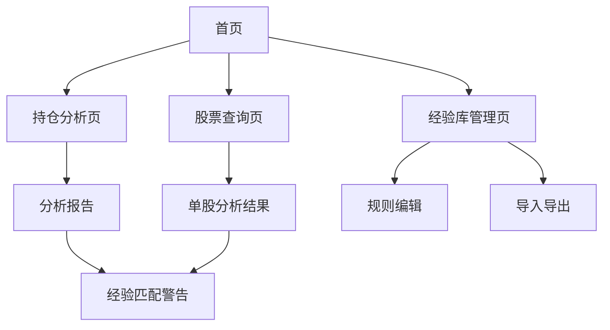

## 1. 产品概述
AI股票助手是一款具备自反思能力的智能投资分析工具，通过整合实时股票数据分析和用户经验规则匹配，为投资者提供专业的股票分析和投资建议。

产品主要解决投资者在海量市场信息中难以快速识别投资机会和风险的问题，帮助用户建立系统化的投资经验库，提升投资决策质量。

## 2. 核心功能

### 2.1 用户角色
本系统为单用户应用，无需区分不同用户角色。用户可通过本地访问直接使用所有功能。

### 2.2 功能模块
AI股票助手包含以下核心页面：
1. **首页**: 持仓概览、快速分析入口、系统状态显示
2. **持仓分析页**: 持仓股票列表、详细分析报告、技术指标图表
3. **股票查询页**: 股票搜索、单股分析、实时数据展示
4. **经验库管理页**: 经验规则列表、规则编辑、导入导出功能

### 2.3 页面详情
| 页面名称 | 模块名称 | 功能描述 |
|---------|---------|----------|
| 首页 | 持仓概览 | 显示当前持仓股票数量、总资产估值、今日涨跌幅统计 |
| 首页 | 快速分析 | 提供一键分析所有持仓股票的功能入口 |
| 首页 | 系统状态 | 显示最近分析时间、下次分析倒计时、API连接状态 |
| 持仓分析页 | 持仓列表 | 展示所有持仓股票代码、名称、持仓数量、当前价格、涨跌幅 |
| 持仓分析页 | 分析报告 | 显示压力位、支撑位、成交量分析、资金流向、综合评分 |
| 持仓分析页 | 技术指标 | 使用ECharts展示K线图、均线、MACD、RSI等技术指标 |
| 持仓分析页 | 经验匹配 | 自动匹配相关经验规则，红色字体显示警告信息 |
| 股票查询页 | 股票搜索 | 支持股票代码和名称搜索，实时联想提示 |
| 股票查询页 | 单股分析 | 显示股票基本信息、技术指标、分析建议 |
| 股票查询页 | 分析结果 | 展示评分、买卖建议、风险提示 |
| 经验库管理页 | 经验列表 | 展示所有经验规则，支持分类和搜索 |
| 经验库管理页 | 规则编辑 | 提供新增、修改、删除经验规则的界面 |
| 经验库管理页 | 导入导出 | 支持JSON格式的经验库导入和导出功能 |

## 3. 核心流程

### 主要用户操作流程：
1. **持仓分析流程**：用户进入首页 → 查看持仓概览 → 点击分析按钮 → 系统调用API分析 → 展示分析报告和经验匹配结果
2. **股票查询流程**：用户进入查询页 → 输入股票代码 → 系统获取实时数据 → 展示分析结果和经验匹配
3. **经验管理流程**：用户进入经验库 → 查看现有规则 → 新增/编辑/删除规则 → 保存到数据库和JSON文件

## 4. 用户界面设计

### 4.1 设计风格
- **主色调**：深蓝色（#1e3a8a）体现专业金融感，辅以绿色（#10b981）表示上涨，红色（#ef4444）表示下跌
- **按钮样式**：圆角矩形设计，主要操作使用实心背景，次要操作使用边框样式
- **字体选择**：中文使用思源黑体，数字使用Roboto Mono等宽字体，确保数字对齐
- **布局风格**：卡片式布局，每个功能模块独立成卡片，阴影效果增强层次感
- **图标风格**：使用Element Plus图标库，保持简洁线性风格

### 4.2 页面设计概览
| 页面名称 | 模块名称 | UI元素 |
|---------|---------|--------|
| 首页 | 持仓概览 | 顶部统计卡片，使用大号字体显示关键数字，涨跌用红绿色区分 |
| 持仓分析页 | 持仓列表 | 表格形式展示，支持排序和筛选，每行显示股票关键信息 |
| 持仓分析页 | 技术指标 | 全宽ECharts图表，支持缩放和指标切换，深色主题 |
| 股票查询页 | 搜索框 | 顶部突出位置，带搜索图标和清除按钮，支持模糊匹配 |
| 经验库管理页 | 规则列表 | 卡片式展示每条规则，包含规则内容、创建时间、匹配次数 |

### 4.3 响应式设计
采用桌面优先设计策略，主界面针对1920x1080分辨率优化。同时支持平板设备自适应，手机端提供基础浏览功能。触摸交互针对平板设备进行优化，按钮和交互元素适当放大。