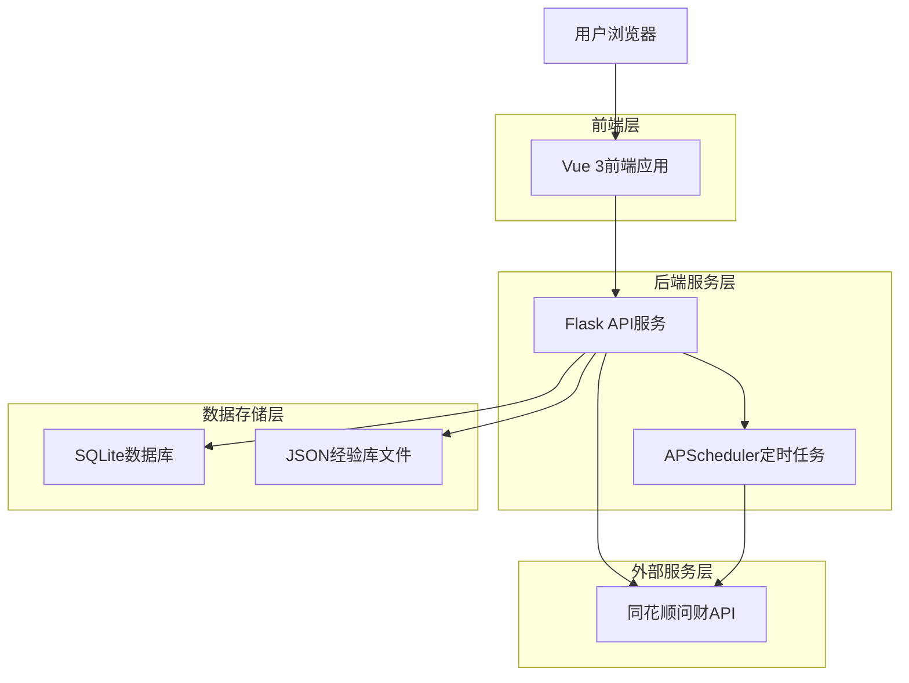
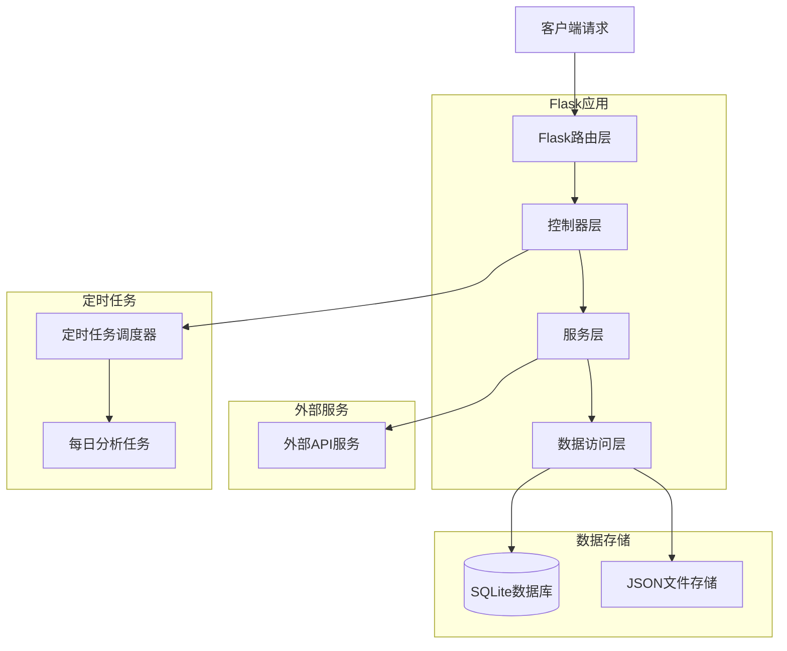
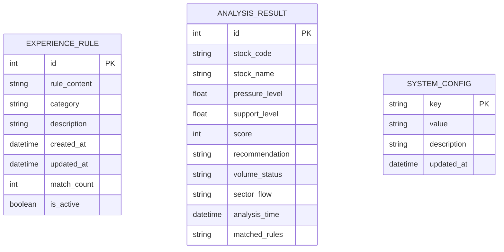

## 1. 架构设计



## 2. 技术栈描述

- **前端**: Vue 3 + Element Plus + ECharts + Vite
- **初始化工具**: vite-init
- **后端**: Flask + APScheduler + SQLite3
- **数据库**: SQLite
- **主要依赖**: 
  - 前端: vue-router@4, pinia, axios, @element-plus/icons-vue
  - 后端: flask-cors, apscheduler, sqlite3, requests

## 3. 路由定义

| 路由 | 用途 |
|------|------|
| / | 首页，显示持仓概览和快速分析入口 |
| /portfolio | 持仓分析页，展示持仓股票详细分析 |
| /search | 股票查询页，支持单只股票分析 |
| /experience | 经验库管理页，管理投资经验规则 |
| /settings | 设置页，配置API密钥和分析参数 |

## 4. API定义

### 4.1 股票分析API

**持仓分析**
```
GET /api/portfolio/analysis
```

响应:
| 参数名 | 参数类型 | 描述 |
|--------|----------|------|
| stocks | array | 持仓股票分析结果列表 |
| timestamp | string | 分析时间戳 |
| status | string | 分析状态 |

**单股分析**
```
GET /api/stock/analysis/<stock_code>
```

响应:
| 参数名 | 参数类型 | 描述 |
|--------|----------|------|
| stock_code | string | 股票代码 |
| name | string | 股票名称 |
| pressure_level | float | 压力位 |
| support_level | float | 支撑位 |
| score | int | 综合评分 (0-100) |
| recommendation | string | 买卖建议 |
| volume_status | string | 成交量状态 |
| sector_flow | string | 板块资金流向 |

### 4.2 经验库API

**获取所有经验规则**
```
GET /api/experience/rules
```

**创建经验规则**
```
POST /api/experience/rules
```

请求:
| 参数名 | 参数类型 | 是否必需 | 描述 |
|--------|----------|----------|------|
| rule | string | 是 | 经验规则内容 |
| category | string | 否 | 规则分类 |
| description | string | 否 | 规则描述 |

**更新经验规则**
```
PUT /api/experience/rules/<rule_id>
```

**删除经验规则**
```
DELETE /api/experience/rules/<rule_id>
```

**导出经验库**
```
GET /api/experience/export
```

**导入经验库**
```
POST /api/experience/import
```

### 4.3 系统API

**获取系统状态**
```
GET /api/system/status
```

响应:
| 参数名 | 参数类型 | 描述 |
|--------|----------|------|
| last_analysis | string | 最近分析时间 |
| next_analysis | string | 下次分析时间 |
| api_status | string | API连接状态 |
| total_rules | int | 经验规则总数 |

**触发手动分析**
```
POST /api/system/trigger-analysis
```

## 5. 服务器架构图



## 6. 数据模型

### 6.1 数据模型定义



### 6.2 数据定义语言

**经验规则表 (experience_rules)**
```sql
-- 创建表
CREATE TABLE experience_rules (
    id INTEGER PRIMARY KEY AUTOINCREMENT,
    rule_content TEXT NOT NULL,
    category VARCHAR(50) DEFAULT 'general',
    description TEXT,
    created_at TIMESTAMP DEFAULT CURRENT_TIMESTAMP,
    updated_at TIMESTAMP DEFAULT CURRENT_TIMESTAMP,
    match_count INTEGER DEFAULT 0,
    is_active BOOLEAN DEFAULT TRUE
);

-- 创建索引
CREATE INDEX idx_experience_rules_category ON experience_rules(category);
CREATE INDEX idx_experience_rules_active ON experience_rules(is_active);
CREATE INDEX idx_experience_rules_created_at ON experience_rules(created_at DESC);
```

**分析结果表 (analysis_results)**
```sql
-- 创建表
CREATE TABLE analysis_results (
    id INTEGER PRIMARY KEY AUTOINCREMENT,
    stock_code VARCHAR(10) NOT NULL,
    stock_name VARCHAR(50) NOT NULL,
    pressure_level DECIMAL(10,2),
    support_level DECIMAL(10,2),
    score INTEGER CHECK (score >= 0 AND score <= 100),
    recommendation VARCHAR(20),
    volume_status VARCHAR(50),
    sector_flow VARCHAR(100),
    analysis_time TIMESTAMP DEFAULT CURRENT_TIMESTAMP,
    matched_rules TEXT,
    UNIQUE(stock_code, analysis_time)
);

-- 创建索引
CREATE INDEX idx_analysis_results_stock_code ON analysis_results(stock_code);
CREATE INDEX idx_analysis_results_analysis_time ON analysis_results(analysis_time DESC);
CREATE INDEX idx_analysis_results_score ON analysis_results(score DESC);
```

**系统配置表 (system_config)**
```sql
-- 创建表
CREATE TABLE system_config (
    key VARCHAR(50) PRIMARY KEY,
    value TEXT NOT NULL,
    description TEXT,
    updated_at TIMESTAMP DEFAULT CURRENT_TIMESTAMP
);

-- 初始化数据
INSERT INTO system_config (key, value, description) VALUES 
('api_base_url', 'https://api.thsi.com', '同花顺API基础地址'),
('analysis_time', '15:00', '每日分析时间'),
('score_threshold', '70', '推荐买入的最低评分'),
('last_analysis_time', '', '最近分析时间'),
('next_analysis_time', '', '下次分析时间');
```

**经验规则初始数据**
```sql
-- 插入默认经验规则
INSERT INTO experience_rules (rule_content, category, description) VALUES 
('尾盘拉升则次日卖出', 'timing', '尾盘30分钟内快速拉升的股票，次日应考虑卖出'),
('成交量异常放大需谨慎', 'volume', '成交量超过5日均量2倍时需要注意风险'),
('板块资金连续流出需减仓', 'sector', '所属板块连续3日资金净流出超过10%'),
('跌破支撑位及时止损', 'technical', '股价跌破重要支撑位且3日内无法收回'),
('MACD金叉且放量可买入', 'technical', 'MACD出现金叉同时成交量放大'),
('连续上涨5日后不追高', 'timing', '股价连续上涨5个交易日后避免追高买入');
```